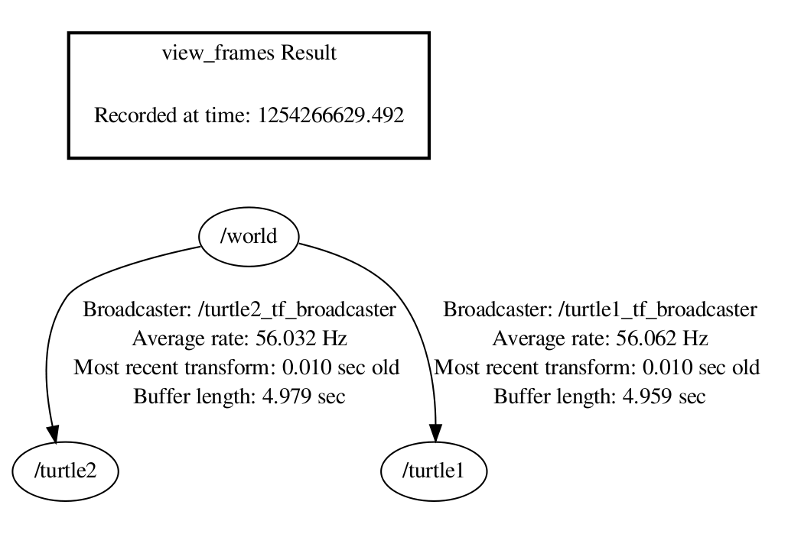

# ROS小车的rviz仿真包

# 1. 两轮差速移动机器人运动分析、建模和控制

参考[博客](https://blog.csdn.net/iProphet/article/details/83661753?utm_medium=distribute.pc_relevant.none-task-blog-BlogCommendFromMachineLearnPai2-3.channel_param&depth_1-utm_source=distribute.pc_relevant.none-task-blog-BlogCommendFromMachineLearnPai2-3.channel_param)

## 1.1 运动学分析建模

运动特性为两轮差速驱动，其底部后方两个同构驱动轮的转动为其提供动力，前方的随动轮起支撑作用并不推动其运动，如图1两轮差速驱动示意图所示。

<div align="center">

</div>

定义其左右驱动轮的中心分别为<a href="https://www.codecogs.com/eqnedit.php?latex=W_l" target="_blank"></a>和<a href="https://www.codecogs.com/eqnedit.php?latex=W_r" target="_blank"></a>，且车体坐标系中这两点在惯性坐标系下移动的线速度为<a href="https://www.codecogs.com/eqnedit.php?latex=v_l" target="_blank"></a>和<a href="https://www.codecogs.com/eqnedit.php?latex=v_r" target="_blank"></a>，理想情况下即为左右轮转动时做圆周运动的线速度。该值可以通过电机驱动接口输出的角转速<a href="https://www.codecogs.com/eqnedit.php?latex=\phi_l" target="_blank"></a>，<a href="https://www.codecogs.com/eqnedit.php?latex=\phi_r" target="_blank"></a>和驱动轮半径<a href="https://www.codecogs.com/eqnedit.php?latex=r" target="_blank"></a>求得，即：

<div align="center">
<a href="https://www.codecogs.com/eqnedit.php?latex=v_l=r*\phi_l" target="_blank"></a>
</div>
<div align="center">
<a href="https://www.codecogs.com/eqnedit.php?latex=v_r=r*\phi_r" target="_blank"></a>
</div>

令两驱动轮中心连线的中点为机器的基点<a href="https://www.codecogs.com/eqnedit.php?latex=C" target="_blank"></a>,<a href="https://www.codecogs.com/eqnedit.php?latex=C" target="_blank"></a>点在大地坐标系<a href="https://www.codecogs.com/eqnedit.php?latex=XOY" target="_blank"></a>下坐标为<a href="https://www.codecogs.com/eqnedit.php?latex=(x,y)" target="_blank"></a>,机器的瞬时线速度为<a href="https://www.codecogs.com/eqnedit.php?latex=v_c" target="_blank"></a>,瞬时角速度为<a href="https://www.codecogs.com/eqnedit.php?latex=\omega_c" target="_blank"></a>，姿态角<a href="https://www.codecogs.com/eqnedit.php?latex=\theta" target="_blank"></a>即为<a href="https://www.codecogs.com/eqnedit.php?latex=v_c" target="_blank"></a>与<a href="https://www.codecogs.com/eqnedit.php?latex=X" target="_blank"></a>轴夹角。此时，机器的位姿信息可用矢量<a href="https://www.codecogs.com/eqnedit.php?latex=\boldsymbol{P}=\begin{bmatrix}x,y,\theta\end{bmatrix}^T" target="_blank"></a>表示。机器人瞬时线速度<a href="https://www.codecogs.com/eqnedit.php?latex=v_c" target="_blank"></a>为：
<div align="center">
<a href="https://www.codecogs.com/eqnedit.php?latex=v_c=\frac{v_r&plus;v_l}{2}" target="_blank"></a>
</div>

令左右轮间距为<a href="https://www.codecogs.com/eqnedit.php?latex=l" target="_blank"></a>,且机器瞬时旋转中心(ICR)为<a href="https://www.codecogs.com/eqnedit.php?latex=O_c" target="_blank"></a>,转动半径即为<a href="https://www.codecogs.com/eqnedit.php?latex=C" target="_blank"></a>到<a href="https://www.codecogs.com/eqnedit.php?latex=O_c" target="_blank"></a>的距离<a href="https://www.codecogs.com/eqnedit.php?latex=R" target="_blank"></a>。机器在做同轴（轴为左右轮到ICR连线）圆周（圆心为ICR）运动时，左右轮及基点所处位置在该圆周运动中的角速度相同<a href="https://www.codecogs.com/eqnedit.php?latex=\omega_l=\omega_r=\omega_c" target="_blank"></a>，到旋转中心的半径不同，有<a href="https://www.codecogs.com/eqnedit.php?latex=l=\frac{v_r}{\omega_r}-\frac{v_l}{\omega_l}" target="_blank"></a>。则机器的瞬时角速度<a href="https://www.codecogs.com/eqnedit.php?latex=\omega_c" target="_blank"></a>可以表示为:

<div align="center">
<a href="https://www.codecogs.com/eqnedit.php?latex=\omega_c=\frac{v_r-v_l}{l}" target="_blank"></a>
</div>

联立两式求出转动半径：

<div align="center">
<a href="https://www.codecogs.com/eqnedit.php?latex=R=\frac{v_c}{\omega_c}=\frac{l}{2}\frac{v_r&plus;v_l}{v_r&plus;v_l}" target="_blank"></a>
</div>

### 1.1.1 三种运动状态分析

差速驱动方式，即V1和V2间存在的速度差关系决定了其具备不同的三种运动状态，如图所示：

<div align="center">

</div>

* 当<a href="https://www.codecogs.com/eqnedit.php?latex=v_l>v_r" target="_blank">v_r" title="v_l>v_r" /></a>时，机器做圆弧运动；
* 当<a href="https://www.codecogs.com/eqnedit.php?latex=v_l=v_r" target="_blank"></a>时，机器做直线运动；
* 当<a href="https://www.codecogs.com/eqnedit.php?latex=v_l=-v_r" target="_blank"></a>时，机器以左右轮中心点做原地旋转。

## 1.2 函数模型

在驱动轮与地面接触运动为纯滚动无滑动情况下，机器的运动学模型可以表示为：

<div align="center">
<a href="https://www.codecogs.com/eqnedit.php?latex=\begin{bmatrix}&space;\dot{x}\\&space;\dot{y}\\&space;\dot{\theta}&space;\end{bmatrix}=\begin{bmatrix}&space;cos\theta&space;&&space;0\\&space;cos\theta&space;&&space;0&space;\\&space;0&&space;1&space;\end{bmatrix}\begin{bmatrix}&space;\frac{1}{2}&space;&&space;\frac{1}{2}\\&space;\frac{1}{l}&space;&&space;-\frac{1}{2}&space;\end{bmatrix}\begin{bmatrix}&space;v_r\\&space;v_l&space;\end{bmatrix}" target="_blank"></a>
</div>

机器人坐标系服从右手定则，其顺时旋转针姿态角减少，逆时针旋转姿态角增加

## 1.3. 运动控制

运动控制的被控对象是所分析的两轮差速移动机器人；直观的控制量是上述建模中所述的左右轮转速，为了更一般的描述车体的运动，控制量选车体线速度<a href="https://www.codecogs.com/eqnedit.php?latex=v" target="_blank"></a>与角速度<a href="https://www.codecogs.com/eqnedit.php?latex=\omega" target="_blank"></a>，左右轮转速可由模型反求取。

### 1.3.1 点到点

控制机器人由当前点移动到指定目标点，其核心是令机器人在控制器作用下（以一定合适的方式）持续地朝向目标点运动。其控制系统框图为：

<div align="center">

</div>

### 1.3.2 任意姿态到达目标点

设机器人实时位姿为<a href="https://www.codecogs.com/eqnedit.php?latex=\begin{bmatrix}&space;x_t&space;&&space;y_t&space;&&space;\theta_t&space;\end{bmatrix}" target="_blank"></a>，目标位置为<a href="https://www.codecogs.com/eqnedit.php?latex=\begin{bmatrix}&space;x_G&space;&&space;y_G&space;&&space;\theta_G&space;\end{bmatrix}" target="_blank"></a>，易求出机器与目标点间实时的距离差<a href="https://www.codecogs.com/eqnedit.php?latex=d_{err}=\sqrt{(x_G-x_t)^2&plus;(y_G-y_t)^2}" target="_blank"></a>与角度差<a href="https://www.codecogs.com/eqnedit.php?latex=\theta_{err}=tan(\frac{y_G-y_t}{x_G-x_t})-\theta_t" target="_blank"></a>(即图中<a href="https://www.codecogs.com/eqnedit.php?latex=\delta=\varphi&space;-\theta" target="_blank"></a>)，如下图所示

<div align="center">

</div>

一种简单通用的控制器，PID控制器可以构成运动控制器。其设计方法是：简单地，运动控制器由两个并联的PID控制器组成：

* 一个PID控制器，输入为距离差<a href="https://www.codecogs.com/eqnedit.php?latex=d_{err}" target="_blank"></a>输入为线速度<a href="https://www.codecogs.com/eqnedit.php?latex=v" target="_blank"></a>，即距离决定速度。距离远速度大，距离近速度小。【多说一句，这里要注意的是速度的连续性，（如起步时距离远，线速度由0跳变为较大值，且距离无穷远速度无穷大）所以需要将**PID输出先限幅再平滑**(即限幅<a href="https://www.codecogs.com/eqnedit.php?latex=\left&space;\|&space;v_{pidout}&space;\right&space;\|\leq&space;v_{max}" target="_blank"></a>,平滑<a href="https://www.codecogs.com/eqnedit.php?latex=\left&space;\|v_{t-1}-&space;v_{pidout}&space;\right&space;\|\leq&space;\sigma" target="_blank"></a>,最后输出<a href="https://www.codecogs.com/eqnedit.php?latex=v_t=v_{pidout}" target="_blank"></a>)

* 另一个PID控制器，输入为距离差<a href="https://www.codecogs.com/eqnedit.php?latex=\theta_{err}" target="_blank"></a>，输出为角速度<a href="https://www.codecogs.com/eqnedit.php?latex=\omega" target="_blank"></a>即偏角误差决定转速。正偏左转，负偏右转；偏多转快，偏少转慢。【多说一句，这里要注意的是角度表示方式带来的过界问题，即当求出的<a href="https://www.codecogs.com/eqnedit.php?latex=\theta_{err}" target="_blank"></a>大于或小于<a href="https://www.codecogs.com/eqnedit.php?latex=\pi" target="_blank"></a>(如<a href="https://www.codecogs.com/eqnedit.php?latex=\varphi&space;=\frac{3\pi}{4}" target="_blank"></a>，<a href="https://www.codecogs.com/eqnedit.php?latex=\theta&space;=-\frac{3\pi}{4}" target="_blank"></a>)时，要将其归一化到<a href="https://www.codecogs.com/eqnedit.php?latex=(-\pi,\pi]" target="_blank"></a>,即<a href="https://www.codecogs.com/eqnedit.php?latex={\color{Red}&space;\pi-2\pi\leq&space;\theta_{err}\leq&space;-\pi&plus;2\pi}" target="_blank"></a>】

使用上述公式求出线速度<a href="https://www.codecogs.com/eqnedit.php?latex=v_c" target="_blank"></a>、角速度<a href="https://www.codecogs.com/eqnedit.php?latex=\omega_c" target="_blank"></a>后，再解算为左右轮转速交给机器执行。控制器会控制机器人持续朝向目标移动，当其距离目标小于一定值，即移动到以目标为圆心，<a href="https://www.codecogs.com/eqnedit.php?latex=\tau" target="_blank"></a>为半径（目标半径）的圆内<a href="https://www.codecogs.com/eqnedit.php?latex=d_{err}\leq&space;\tau" target="_blank"></a>时，判定机器人到达目标位置，完成运动控制过程。

上述点到点的运动控制只要求到达目标点，并没有其他约束条件，虽然在实际应用中往往会有许多约束，但是其确是一切运动控制的基石。

在某些具体应用中，如泊车parking，对接docking等往往需要机器人以某个固定的姿态到达某一具体位置。


# 2. 两轮差速底盘的运动模型分析：运动控制与里程计解算

参考[博客](https://blog.csdn.net/xingdou520/article/details/83691951)

<div align="center">


</div>


# 3. TF与URDF

## 3.1 ROS中的TF

参考自[《机器人操作系统入门》讲义](https://sychaichangkun.gitbooks.io/ros-tutorial-icourse163/content/chapter8/8.1.html).

坐标变换包括了$\color{red}{位置}$和$\color{red}{姿态}$两个方面的变换。ROS中的tf是一个可以让用户随时记录多个坐标系的软件包，tf保持缓存的树形结构中的坐标系之间的关系，并且允许用户在任何期望的时间点在任何两个坐标系之间转换点，矢量等。

，ROS中机器人模型包含大量的部件，这些部件统称之为link,每一个link上面对应着一个frame, 即一个坐标系．link和frame概念是绑定在一起的。各个坐标系之间的关系，就要靠着tf tree来处理，tf tree维护着各个坐标系之间的联通。
<div align="center">

</div>

上图是我们常用的robot_sim_demo运行起来的tf　tree结构，

每一个圆圈代表一个frame,对应着机器人上的一个link，

任意的两个frame之间都必须是联通的，如果出现某一环节的断裂，就会引发error系统报错．

所以完整的tf tree不能有任何断层的地方，这样我们才能查清楚任意两个frame之间的关系。

每两个frame之间都有一个broadcaster,这就是为了使得两个frame之间能够正确连通，中间都会有一个Node发布消息来broadcaster，如果缺少Node来发布消息维护连通，那么这两个frame之间的连接就会断掉。

broadcaster就是一个publisher,如果两个frame之间发生了相对运动，broadcaster就会发布相关消息．

## 3.2 TF消息

### 3.2.1 TransformStampde.msg

消息TransformStampde.msg就是处理两个frame之间一小段tf的数据格式;

```python
std_mags/Header header
        uint32 seq      #序号
        time stamp      # 时间
        string frame_id #frame名称
string child_frame_id   #子frame名称
geometry_msgs/Transform transform #子frame和frame的坐标变换
        geometry_msgs/Vector3 translation #平移
                float64 x
                float64 y
                float64 z
        geometry_msgs/Quaternion rotation #四元数，表示旋转
                float64 x
                float64 y
                flaot64 z
                float64 w
```

### 3.2.2 TF树的数据类型

* tf/tfMessage.msg，tf第一代已被“弃用”
* tf2_msgs/TFMessage.msg,官网建议新工作直接使用tf2

tf/tfMessage.msg或tf2_msgs/TFMessage标准格式规范如下:

```python
geometry_msgs/TransformStamped[] transforms
        std_msgs/Header header
                uint32 seq
                time stamp
                string frame_id
        string child_frame_id
        geometry_msgs/Transform transform
                geometry_msgs/Vector3 translation
                        float64 x
                        float64 y
                        float64 z
                geometry_msgs/Quaternion rotation
                        float64 x
                        float64 y
                        flaot64 z
                        float64 w
```

## 3.3 tf in C++

### 3.3.1 TF的数据类型

| 名称                | 数据类型             |
| ------------------- | -------------------- |
| 向量                | tf::Vector3          |
| 点                  | tf::Point            |
| 四元数              | tf::Quaternion       |
| 3*3矩阵（旋转矩阵） | tf::Matrix3x3        |
| 位姿                | tf::pose             |
| 变换                | tf::Transform        |
| 带时间戳的以上类型  | tf::Stamped          |
| 带时间戳的变换      | tf::StampedTransform |

数据转换

<div align="center">

</div>

数据转换[示例代码](../../beginner_tutorials/src/coordinate_transformation.cc)

### 3.3.2 tf::TransformBroadcaster类
```C++
transformBroadcaster()
void sendTransform(const StampedTransform &transform)
void sendTransform(const std::vector<StampedTransform> &transforms)
void sendTransform(const geometry_msgs::TransformStamped &transform)
void sendTransform(const std::vector<geometry_msgs::TransformStamped> &transforms)
```

broadcaster就是一个publisher,而sendTransform的作用是来封装publish的函数;

实际的使用中,在某个Node中构建tf::TransformBroadcaster类，然后调用sendTransform(),将transform发布到/tf的一段transform上，/tf里的transform为我们重载了多种不同的函数类型；

示例代码: 

[turtle_tf2_broadcaster.cc](../../beginner_tutorials/src/turtle_tf2_broadcaster.cc)

[turtle_tf2_listener](../../beginner_tutorials/src/turtle_tf2_listener.cc)

### 3.3.2 增加一个frame

1. 为什么增加框架?

对于许多任务，在局部框架内进行思考更容易,例如,最容易在激光扫描仪中心的框架中进行激光扫描。tf2允许您为系统中的每个**传感器、链接**等定义本地框架。 而且，tf2将处理所有引入的额外框架转换。

2. 往哪里加入框架

tf2建立框架的树形结构； 它不允许框架结构中存在闭环。 这意味着一个框架只有一个单亲，但可以有多个孩子。 当前，我们的tf2树包含三个框架：world，turtle1和turtle2。 两只乌龟是世界的孩子。 如果要向tf2添加新框架，则需要将三个现有框架之一作为父框架，新框架将成为子框架。

<div align="center">

</div>

1. 代码示例

[frame_tf2_broadcaster.cc](../../beginner_tutorials/src/frame_tf2_broadcaster.cc)

### 3.3.3 在tf2_ros::MessageFilter中使用Stamped数据类型

 tf2_ros::MessageFilter将使用 Header为任何ros消息订阅并将其缓存，直到可以将其转换为目标框架为止

 [代码示例](../../beginner_tutorials/src/message_filter.cc)

 ## 3.4 使用TF设置机器人

 ### 3.4.1 变换配置

 许多ROS软件包要求使用tf软件库发布机器人的变换树。在抽象级别上，变换树根据不同坐标系之间的平移和旋转来定义偏移量。 
 
 为了更加具体，请考虑一个简单的机器人示例，该机器人具有一个可移动的基座，并在其上方安装了一个激光器。
 
  关于机器人，我们定义两个坐标系：一个对应于机器人基座的中心点，另一个对应于安装在基座顶部的激光的中心点。 让我们给它们起个简单的参考。 我们将附着在移动基座上的坐标系称为“base_link”（对于导航，将其放置在机器人的旋转中心很重要），我们将附着在激光器上的坐标系称为“base_laser”。

  在这一点上，让我们假设我们有一些来自激光器的数据，其形式是到激光器中心点的距离。 换句话说，我们在“ base_laser”坐标系中有一些数据。 现在假设我们要获取这些数据并将其用于帮助移动基地避免世界上的障碍。 为了成功完成此任务，我们需要一种将已从“ base_laser”框架接收到的激光扫描转换为“ base_link”框架的方法。 本质上，我们需要定义“ base_laser”和“ base_link”坐标系之间的关系。

  <div align="center">
  
  </div>

  在定义这种关系时，假设我们知道激光器安装在移动基座中心点前方10厘米和上方20厘米处。这给了我们一个平移偏移量，它将“base_link”框架与“base_laser”框架关联起来。具体地说，我们知道，要从“base_link”框架到“base_laser”框架获取数据，必须应用平移（x:0.1m，y:0.0m，z:0.2m），而要从“base_laser”框架获取数据到“base_link”框架，我们必须应用相反的平移（x:-0.1m，y:0.0m，z:-0.20m）

  我们可以选择自己管理这种关系，这意味着在必要时在框架之间存储和应用适当的转换，但是随着坐标框架数量的增加，这将非常麻烦。不过，幸运的是，我们不必自己做这项工作。我们将使用tf定义“base_link”和“base_laser”之间的关系，并让它为我们管理两个坐标系之间的转换。

  要使用tf定义和存储“base_link”和“base_laser”框架之间的关系，我们需要将它们添加到一个转换树中。从概念上讲，变换树中的每个节点对应于一个坐标系，每个边对应于从当前节点移动到其子节点所需应用的变换。Tf使用树结构来保证只有一次遍历将任意两个坐标框架链接在一起，并假设树中的所有边都从父节点指向子节点。

   <div align="center">
  
  </div>

  要为我们的简单示例创建一个转换树，我们将创建两个节点，一个用于“base_link”坐标系，另一个用于“base_laser”坐标系。要在它们之间创建边，我们首先需要决定哪个节点将是父节点，哪个节点将是子节点。请记住，这种区别很重要，因为tf假设所有的转换都从父对象移动到子对象。让我们选择“base_-link”坐标系作为父坐标系，因为当其他工件/传感器被添加到机器人上时，它们通过遍历“base_-link”坐标系与“base_-laser”坐标系相关联是最有意义的。这意味着与连接“base_link”和“base_laser”的边缘相关的变换应为（x:0.1m，y:0.0m，z:0.2m）。建立了转换树后，将“base_laser”帧中接收到的激光扫描转换为“base_link”帧非常简单，只需调用tf库即可。我们的机器人可以利用这些信息来推断“base_link”框架中的激光扫描，并在周围环境中安全地规划障碍物。

  代码示例:[tf_broadcaster](https://raw.githubusercontent.com/ros-planning/navigation_tutorials/indigo-devel/robot_setup_tf_tutorial/src/tf_broadcaster.cpp)

## 3.5 在自己的机器人上使用机器人状态发布器

  机器人状态发布者可帮助您将机器人的状态广播到tf转换库。 机器人状态发布者在内部具有机器人的运动学模型。 因此，根据机器人的关节位置，机器人状态发布者可以计算并广播机器人中每个链接的3D姿态

### 3.5.1 作为ROS节点运行

运行机器人状态发布者的最简单方法是作为节点。 对于普通用户，这是建议的用法。 您需要执行以下两项操作来运行机械手状态发布器.

小车的TF树如下图所示

<div align="center">

</div>