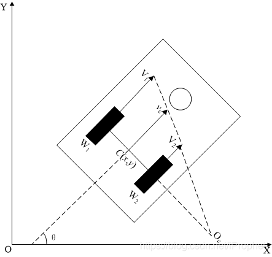
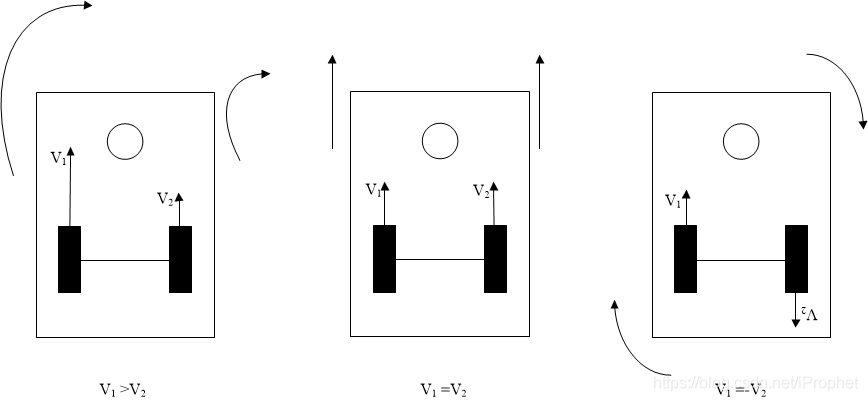
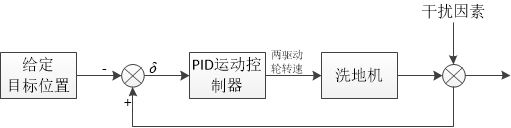
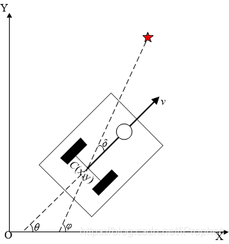
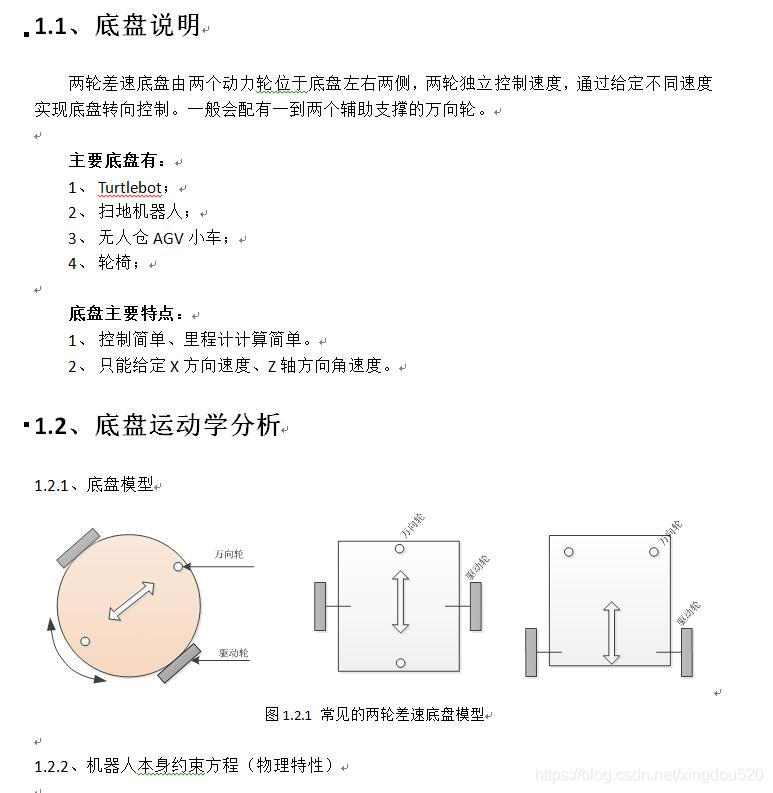
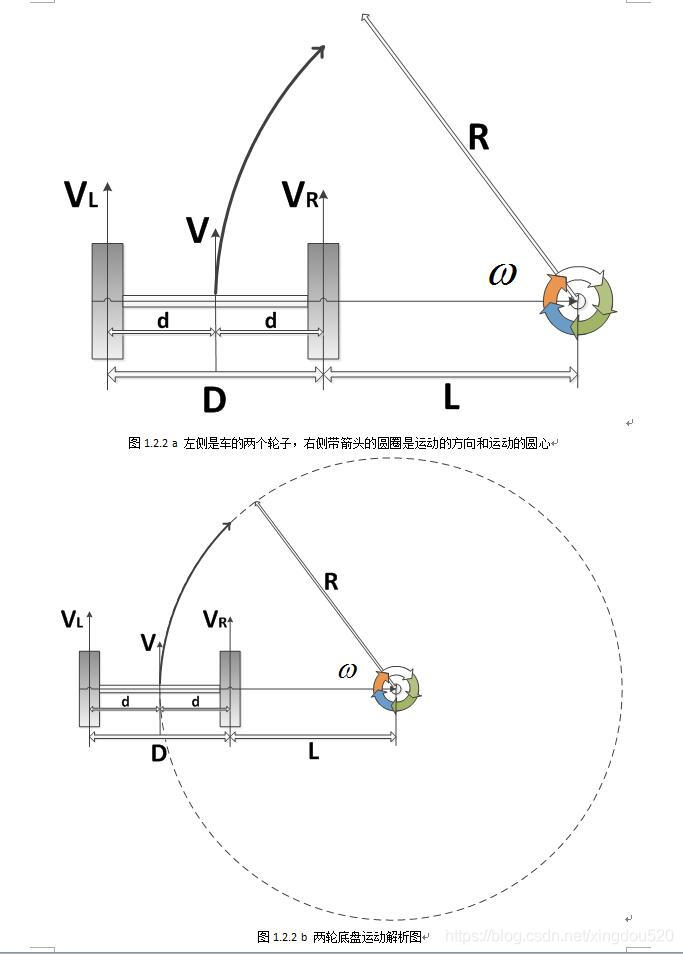
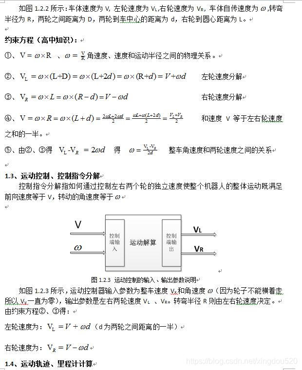
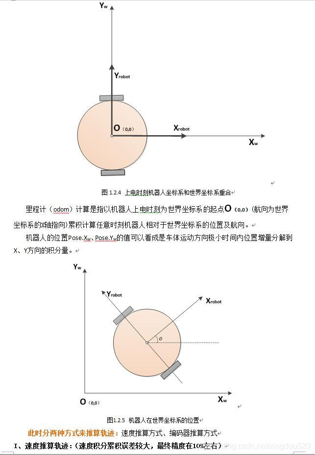
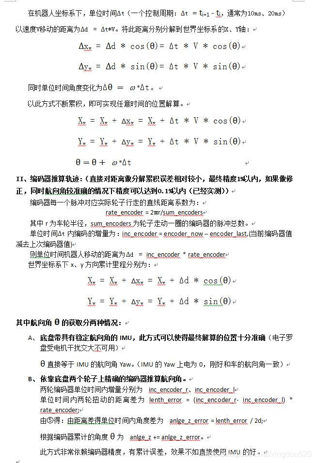

# ROS小车的rviz仿真包

# 1. 两轮差速移动机器人运动分析、建模和控制

参考[博客](https://blog.csdn.net/iProphet/article/details/83661753?utm_medium=distribute.pc_relevant.none-task-blog-BlogCommendFromMachineLearnPai2-3.channel_param&depth_1-utm_source=distribute.pc_relevant.none-task-blog-BlogCommendFromMachineLearnPai2-3.channel_param)

## 1.1 运动学分析建模

运动特性为两轮差速驱动，其底部后方两个同构驱动轮的转动为其提供动力，前方的随动轮起支撑作用并不推动其运动，如图1两轮差速驱动示意图所示。

定义其左右驱动轮的中心分别为和，且车体坐标系中这两点在惯性坐标系下移动的线速度为和，理想情况下即为左右轮转动时做圆周运动的线速度。该值可以通过电机驱动接口输出的角转速，和驱动轮半径求得，即：

令两驱动轮中心连线的中点为机器的基点,点在大地坐标系下坐标为,机器的瞬时线速度为,瞬时角速度为，姿态角即为与轴夹角。此时，机器的位姿信息可用矢量表示。机器人瞬时线速度为：

令左右轮间距为,且机器瞬时旋转中心(ICR)为,转动半径即为到的距离。机器在做同轴（轴为左右轮到ICR连线）圆周（圆心为ICR）运动时，左右轮及基点所处位置在该圆周运动中的角速度相同，到旋转中心的半径不同，有。则机器的瞬时角速度可以表示为:

联立两式求出转动半径：

### 1.1.1 三种运动状态分析

差速驱动方式，即V1和V2间存在的速度差关系决定了其具备不同的三种运动状态，如图所示：

* 当<a href="https://www.codecogs.com/eqnedit.php?latex=v_l>v_r" target="_blank">v_r" title="v_l>v_r" /></a>时，机器做圆弧运动；
* 当时，机器做直线运动；
* 当时，机器以左右轮中心点做原地旋转。

## 1.2 函数模型

在驱动轮与地面接触运动为纯滚动无滑动情况下，机器的运动学模型可以表示为：

机器人坐标系服从右手定则，其顺时旋转针姿态角减少，逆时针旋转姿态角增加

## 1.3. 运动控制

运动控制的被控对象是所分析的两轮差速移动机器人；直观的控制量是上述建模中所述的左右轮转速，为了更一般的描述车体的运动，控制量选车体线速度与角速度，左右轮转速可由模型反求取。

### 1.3.1 点到点

控制机器人由当前点移动到指定目标点，其核心是令机器人在控制器作用下（以一定合适的方式）持续地朝向目标点运动。其控制系统框图为：

### 1.3.2 任意姿态到达目标点

设机器人实时位姿为，目标位置为，易求出机器与目标点间实时的距离差与角度差(即图中)，如下图所示

一种简单通用的控制器，PID控制器可以构成运动控制器。其设计方法是：简单地，运动控制器由两个并联的PID控制器组成：

* 一个PID控制器，输入为距离差输入为线速度，即距离决定速度。距离远速度大，距离近速度小。【多说一句，这里要注意的是速度的连续性，（如起步时距离远，线速度由0跳变为较大值，且距离无穷远速度无穷大）所以需要将**PID输出先限幅再平滑**(即限幅,平滑,最后输出)

* 另一个PID控制器，输入为距离差，输出为角速度即偏角误差决定转速。正偏左转，负偏右转；偏多转快，偏少转慢。【多说一句，这里要注意的是角度表示方式带来的过界问题，即当求出的大于或小于(如，)时，要将其归一化到,即】

使用上述公式求出线速度、角速度后，再解算为左右轮转速交给机器执行。控制器会控制机器人持续朝向目标移动，当其距离目标小于一定值，即移动到以目标为圆心，为半径（目标半径）的圆内时，判定机器人到达目标位置，完成运动控制过程。

上述点到点的运动控制只要求到达目标点，并没有其他约束条件，虽然在实际应用中往往会有许多约束，但是其确是一切运动控制的基石。

在某些具体应用中，如泊车parking，对接docking等往往需要机器人以某个固定的姿态到达某一具体位置。

# 2. 两轮差速底盘的运动模型分析：运动控制与里程计解算

参考[博客](https://blog.csdn.net/xingdou520/article/details/83691951)

