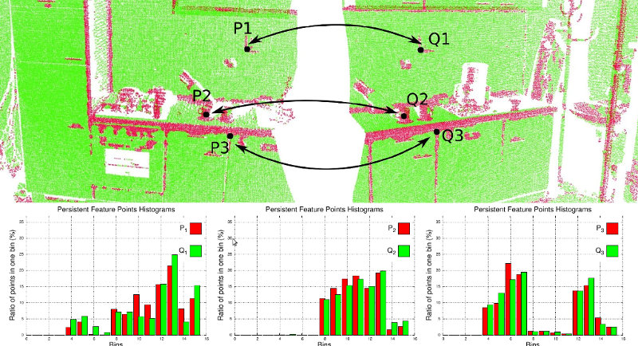
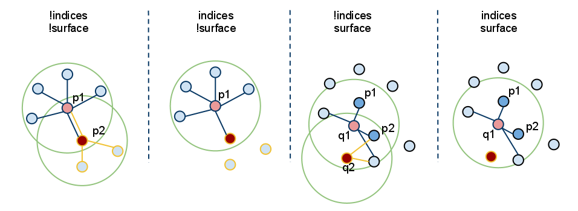

# 一、特征

## 1 3D功能如何在PCL中工作

本文档介绍了PCL中的3D特征估计方法，并为对pcl :: Feature类内部感兴趣的用户或开发人员提供了指南

### 1.1 理论预备

来自[RusuDissertation](./docs/941254.pdf):

在他们原始的表示中，使用3D映射系统概念中定义的点可用相对于给定原点的直角坐标x，y，z简单表示。假设坐标系的原点不随时间变化，则可能存在两个在t1和t2时刻采集的具有相同坐标的点p1和p2。然而，比较这些点是一个不适当的问题，因为即使它们在某种距离度量（例如欧氏度量）方面是相等的，也可以在完全不同的表面上对其进行采样，因此与周围的其它点坐标一起使用时，它们表示的信息完全不同。 那是因为不能保证世界在t1和t2之间没有改变。 一些采集设备可能会为采样点提供额外的信息，例如强度或表面反射率值，甚至是颜色，但是这不能完全解决问题，并且比较仍然模棱两可。

由于各种原因需要比较点的应用程序需要更好的特性和度量，以便能够区分几何表面。因此，将3D点作为具有笛卡尔坐标的奇异实体的概念消失了，取而代之的是局部描述符的新概念。 文献中有大量描述相同概念的不同命名方案，例如形状描述符或几何特征，但对于本文档的其余部分，它们将称为点特征表示。

...

通过【包含周围的邻点】，可以推断出基本的采样表面几何形状并将其捕获到特征公式中，这有助于解决歧义比较问题。 理想情况下，对于位于相同或相似表面上的点，所得特征将非常相似（相对于某些度量标准），对于在不同表面上发现的点，所得特征将非常不同，如下图所示。 好的点要素表示法可以通过在存在以下的情况下捕获相同的局部表面特征来将自己与坏的点区分开：

* 刚性变换-也就是说，数据中的3D旋转和3D平移不应影响结果特征向量F的估计；
* 变化的采样密度-原则上，或多或少密集采样的局部表面补丁应具有相同的特征矢量签名；
* 噪声-在数据中存在轻微噪声的情况下，点要素表示必须在其特征向量中保留相同或非常相似的值。

<div align="center">

</div>

通常，PCL功能使用近似的方法通过快速的kd树查询来计算查询点的最近邻居。 我们感兴趣的查询有两种：

* 确定查询点的k个（用户给定参数）邻居（也称为k搜索）；
* 确定半径为r的球面内的查询点的所有邻居（也称为“半径搜索”）。

-----------------------------------------------------------
Note:
有关正确的k或r值应该是什么的讨论，请参阅[RusuDissertation](./docs/941254.pdf)

-----------------------------------------------------------

### 1.2 术语

在本文的其余部分，我们将使用某些缩写词并引入某些表示法，以简化文本中的解释。 请参阅下表以获取有关所用每个术语的参考。

### 1.3 如何传入输入

由于PCL中几乎所有类都继承自基本pcl::PCLBase类，因此pcl::Feature类以两种不同的方式接受输入数据：

1. 通过setInputCloud（PointCloudConstPtr＆）给出的整个点云数据集-强制性任何特征估计类都将尝试估计给定输入云中每个点的特征;
2. 通过setInputCloud（PointCloudConstPtr＆）和setIndices（IndicesConstPtr＆）给出的点云数据集的子集-可选
   
   任何特征估计类都将尝试估计给定输入云中在给定索引列表中具有索引的每个点的特征。 默认情况下，如果未给出索引集，则将考虑云中的所有点。

此外，可以通过其他调用setSearchSurface（PointCloudConstPtr＆）来指定要使用的点邻居集。 此调用是可选的，并且在未提供搜索范围的情况下，默认情况下将使用输入点云数据集。

由于始终需要setInputCloud（），因此最多可以使用\<setInputCloud（），setIndices（），setSearchSurface（）\>创建四个组合。 假设我们有两个点云，P = {p_1，p_2，…p_n}和Q = {q_1，q_2，…，q_n}。 下图显示了所有四种情况：

<div align="center">

</div>

* setIndices（）=false，setSearchSurface（）=false-毫无疑问，这是PCL中最常用的情况，用户仅输入单个PointCloud数据集，并期望在云中的所有点处估计某个特征。

由于我们不希望根据是否给出一组索引和/或搜索表面来维护不同的实现副本，因此每当index = false时，PCL就会创建一组内部索引（作为std :: vector <int>）， 基本上指向整个数据集（索引= 1..N，其中N是云中的点数）。

在上图中，这对应于最左侧的情况。 首先，我们估计p_1的最近邻居，然后估计p_2的最近邻居，依此类推，直到我们用尽P中的所有点。

* setIndices（）= true，setSearchSurface（）= false-如前所述，特征估计方法将仅计算在给定索引向量中具有索引的那些点的特征；

在上图中，这对应于第二种情况。 在这里，我们假设p_2的索引不是给定索引向量的一部分，因此在p2不会估计任何邻居或特征。

* setIndices（）= false，setSearchSurface（）= true-与第一种情况一样，将对输入作为给定的所有点进行特征估计，但是setSearchSurface（）中给定的基础相邻表面将用于获取输入的最近邻居 点，而不是输入云本身；

在上图中，这对应于第三种情况。 如果Q = {q_1，q_2}是作为输入给出的另一个云，与P不同，并且P是Q的搜索面，则将从P计算q_1和q_2的邻居。

* setIndices（）= true，setSearchSurface（）= true-这可能是最罕见的情况，同时给出了索引和搜索表面。 在这种情况下，将使用setSearchSurface（）中提供的搜索表面信息，仅针对<input，indexs>对中的一个子集估算要素。

最后，在上图中，这对应于最后一个（最右边）情况。 在此，我们假设q_2的索引不属于为Q提供的索引向量，因此在q2处不会估计任何邻居或特征。

应该使用setSearchSurface（）的最有用的示例是，当我们有一个非常密集的输入数据集，但是我们不想估计其中所有点的特征，而是要估计使用pcl_keypoints中的方法发现的一些关键点时，或者 在云的降采样版本上（例如，使用pcl :: VoxelGrid <T>过滤器获得）。 在这种情况下，我们通过setInputCloud（）传递降采样/关键点输入，并将原始数据作为setSearchSurface（）传递。

### 1.3 正常估计的例子

一旦确定，查询点的相邻点可以用于估计局部特征表示，该局部特征表示捕获查询点周围的基础采样表面的几何形状。 描述表面几何形状的一个重要问题是首先在坐标系中推断其方向，即估算其法线。 表面法线是表面的重要属性，在许多领域（例如计算机图形应用程序）中大量使用，以应用正确的光源以生成阴影和其他视觉效果（有关更多信息，请参见请参阅[RusuDissertation](./docs/941254.pdf)）。

[代码](./src/example.cc)
## 2 估计点云中的表面法线

表面法线是几何表面中的重要属性，在很多地方都有大量使用(例如计算机图形学)以应用正确的光源产生阴影和其他视觉效果。

给定一个几何表面，通常很难将表面某点的法线方向推断为垂直于该点表面的向量。但是，由于我们获取的点云数据集表示真实表面上的一组点样本，因此有两种可能性：

* 使用表面网格化技术从获取的点云数据集中获取基础表面，然后从网格中计算表面法线；
* 使用近似值直接从点云数据集中推断表面法线。

本教程将解决后者，即给定点云数据集，直接计算云中每个点的表面法线。

### 2.1 理论准备

虽然有很多不同的法线估计方法，本教程我们关注最简单的一种。确定表面上某个点的法线的问题可以通过估计与该表面相切的平面的法线的问题来近似，这又成为了最小二乘平面拟合估计问题。

<div>

</div>

其中a、b、c就是该预求解的平面的法向量，法向量n=(a,b,c)。由空间解析几何的知识，法向量为最小特征值所对应的值

有关更多信息，包括最小二乘问题的数学方程式，请参见[RusuDissertation](./docs/941254.pdf)

因此，将估计表面法线的解决方案简化为对从查询点的最近邻创建的协方差矩阵的特征向量和特征值（或PCA –主成分分析）进行分析。 更具体地说，对于每个点，我们将协方差矩阵组装如下：

<div align="center">

</div>

<a href="https://www.codecogs.com/eqnedit.php?latex=k" target="_blank"></a>是考虑近邻<a href="https://www.codecogs.com/eqnedit.php?latex=p_i" target="_blank"></a>中近邻点的数量，<a href="https://www.codecogs.com/eqnedit.php?latex=\bar{p}" target="_blank"></a>代表近邻的3D重心，<a href="https://www.codecogs.com/eqnedit.php?latex=\lambda_j" target="_blank"></a>是协方差矩阵的第j个特征值，<a href="https://www.codecogs.com/eqnedit.php?latex=\vec{v}" target="_blank"></a>是第j个特征向量；

要从PCL中的一组点估计协方差矩阵，可以使用：

```
  // Placeholder for the 3x3 covariance matrix at each surface patch
  Eigen::Matrix3f covariance_matrix;
  // 16-bytes aligned placeholder for the XYZ centroid of a surface patch
  Eigen::Vector4f xyz_centroid;

  // Estimate the XYZ centroid
  compute3DCentroid (cloud, xyz_centroid);

  // Compute the 3x3 covariance matrix
  computeCovarianceMatrix (cloud, xyz_centroid, covariance_matrix);
```

通常，由于没有数学方法可以解决法线的正负号，因此，如上所示，通过主成分分析（PCA）计算出的法线方向是模棱两可的，并且在整个点云数据集上的方向不一致。 下图在代表厨房环境一部分的较大数据集的两个部分上呈现了这些影响。 图的右侧部分显示了扩展高斯图像（EGI），也称为法线球，它描述了点云中所有法线的方向。 由于数据集是2.5D的，因此是从单个角度获取的，因此法线应该仅出现在EGI中球体的一半上。 但是，由于方向不一致，它们分布在整个球体上。
<div align="center">


</div>

如果观测点实际上是已知的，则该问题的解决方案很简单。 为了使所有法线始终一致地朝向视点，它们需要满足以下方程式：

<div>

</div>

下图显示了上图数据集中的所有法线均一致指向视点之后的结果。

<div>


</div>

要在PCL中手动重新定向给定点，可以使用：

```
flipNormalTowardsViewpoint (const PointT &point, float vp_x, float vp_y, float vp_z, Eigen::Vector4f &normal);
```

如果数据集具有多个采集视点，则上述常规重定位方法将不成立，并且需要实现更复杂的算法。 有关更多信息，请参见[RusuDissertation](./docs/941254.pdf)

### 2.2 选择合适的规模

如前所述，需要根据该点的周围点邻域支撑（也称为k邻域）来估算该点的表面法线。

最近邻估计问题的细节提出了正确的比例因子的问题：给定采样点云数据集，什么是正确的k（通过pcl :: Feature :: setKSearch给出）或r（通过pcl :: Feature给出） :: setRadiusSearch）值，该值可用于确定点的最近邻居？

这个问题非常重要，并且构成了点特征表示的自动估计（即，在没有用户给定阈值的情况下）的限制因素。 为了更好地说明此问题，下图显示了选择较小比例（即较小的r或k）与较大比例（即较大的r或k）的效果。 图的左侧部分描绘了一个合理的精心选择的比例因子，其中估计的表面法线大致垂直于两个平面，并且在整个表格中可见小的边缘。 但是，如果比例因子太大（右侧部分），因此相邻对象的集合覆盖了相邻表面较大的点，则估计的点要素表示会失真，在两个平面边缘处旋转的曲面法线会被涂抹 边缘和压制的精细细节。

<div>


</div>

无需赘述太多，只需假设现在必须根据应用程序所需的详细程度来选择确定点的邻域的比例即可。 简而言之，如果杯子的手柄和圆柱部分之间的边缘处的曲率很重要，则比例因子必须足够小以捕获这些细节，否则要大。

### 2.3 估计法线

尽管“功能”中已经给出了法线估计的示例，但是我们将在此处修改其中一个，以更好地说明幕后情况。

[代码片段](./src/features.cc)将为输入数据集中的所有点估计一组表面法线。

来自NormalEstimation类的实际计算调用在内部只执行以下操作:
```
for each point p in cloud P

  1. get the nearest neighbors of p

  2. compute the surface normal n of p

  3. check if n is consistently oriented towards the viewpoint and flip otherwise
```

视点默认为（0,0,0），可以通过以下方式更改：
```
setViewPoint (float vpx, float vpy, float vpz);
```

要计算单点法线，请使用：
```
computePointNormal (const pcl::PointCloud<PointInT> &cloud, const std::vector<int> &indices, Eigen::Vector4f &plane_parameters, float &curvature);
```

其中cloud是包含点的输入点云，索引表示云中k个近邻的集合，plane_parameters和曲率表示法线估计的输出，plane_parameters的前三个坐标保持法线（nx，ny，nz）不变，第四个坐标为D = nc.p_plane（此处为质心）+ p。 输出表面曲率被估计为协方差矩阵的特征值之间的关系（如上所述），如下所示
<div align="center">

</div>

### 2.4 使用OpenMP加速法线估计

对于精通速度的用户，PCL提供了表面法线估计的其他实现，该方法使用OpenMP的多核/多线程范例来加快计算速度。 该类的名称为pcl :: NormalEstimationOMP，其API与单线程pcl :: NormalEstimation 100％兼容，这使其适合作为嵌入式替代。 在具有8个内核的系统上，您应该获得6-8倍的更快计算时间。

如果您的数据集是有组织的（例如，使用TOF摄像头，立体摄像头等获取的-即具有宽度和高度），则要获得更快的结果，请参阅使用[积分图像进行正态估计](https://pcl.readthedocs.io/projects/tutorials/en/latest/normal_estimation_using_integral_images.html#normal-estimation-using-integral-images)。

## 3 点特征直方图(PFH)描述符

随着点特征表示的发展，表面法线和曲率估计在围绕特定点的几何图形表示中有些基础。 尽管它们非常快速且易于计算，但它们无法捕获太多细节，因为它们仅用几个值来近似点的k邻域的几何形状。 直接的结果是，大多数场景将包含许多具有相同或非常相似的特征值的点，从而降低了它们的信息特征。

为了简单起见，本教程介绍了3D特征描述符（称为PFH（点特征直方图））系列，介绍了它们的理论优势，并从PCL的角度讨论了实现细节。 作为先决条件，请先阅读PointCloud教程中的“估计表面法线”，因为PFH签名依赖于xyz 3D数据以及表面法线。

### 3.1 理论准备

PFH公式的目的是通过使用值的多维直方图来概括点周围的平均曲率，从而对点的k邻域几何特性进行编码。 此高维超空间为特征表示提供了有意义的签名，对于下层表面的6D姿势不变，并且很好地应对了邻域中存在的不同采样密度或噪声水平。

点特征直方图表示基于k邻域中的点与其估计的表面法线之间的关系。 简而言之，它试图通过考虑估计法线方向之间的所有相互作用来尽可能地捕获采样的表面变化。 因此，最终的超空间取决于每个点的表面法线估计的质量。

下图显示了查询点的PFH计算的影响区域图,该查询点用红色标记并放置在半径为r的圆和所有k个邻居（距离小于的点）的中间(（3D球体） 半径r）)，所有点在网格中完全互连， 最终的PFH描述符被计算为附近所有点对之间的关​​系直方图，因此计算复杂度为
<div align="centet">

</div>

为了计算点和点<ing src=https://pcl.readthedocs.io/projects/tutorials/en/latest/_images/math/1190488800b0c07da55d5e0ad0670b6057326799.png>的相对差异和相关法线与，我们在这些点之一处定义一个固定的坐标系（请参见下图）。

<div>


</div>

使用上面的uvw框架，两个法线之间的差异可以表示为一组角度特征，如下所示

<div>

</div>

其中d是点和点<ing src=https://pcl.readthedocs.io/projects/tutorials/en/latest/_images/math/1190488800b0c07da55d5e0ad0670b6057326799.png>之间的欧氏距离，，四个元素是针对k邻域中的每两对点计算的，因此将两个点及其法线的12个值（xyz和法线信息）减小为4个值；

要估计一对点的PFH四联体，请使用
```
computePairFeatures (const Eigen::Vector4f &p1, const Eigen::Vector4f &n1,
                     const Eigen::Vector4f &p2, const Eigen::Vector4f &n2,
                     float &f1, float &f2, float &f3, float &f4);
```

有关其他详细信息，请参见API文档。

为了为查询点创建最终的PFH表示，将所有四元组的集合合并到直方图中。 合并过程将每个要素的值范围划分为b个子区间，并计算每个子区间中出现的次数。 由于上述四个特征中的三个是法线之间角度的量度，因此可以很容易地将其值归一化为三角圆上的相同间隔。 一个分箱示例是将每个特征区间划分为相同数量的相等部分，因此创建一个直方图，在完全相关的空间中具有分箱。 在此空间中，直方图bin增量对应于所有4个特征都具有特定值的点。 下图显示了云中不同点的点特征直方图表示的示例。

在某些情况下，第四个特征d对于2.5D数据集(通常在机器人中获得)不具有极端意义，因为相邻点之间的距离从视点开始增加。因此，对于局部点密度影响特征维数的扫描，省略d被证明是有益的。

最终，把两个点及其法线的12个值（xyz和法线信息）减小为3个值；

<div>

</div>

### 3.2 估计PFH特性

点特征直方图在pcl中作为pcl_features库的一部分实现。

默认的PFH实现使用5个装箱细分（例如，四个要素值中的每一个将从其值间隔中使用这么多的装箱），并且不包括距离（如上所述），尽管用户可以调用computePairFeatures方法来： 如果需要，也可以获取距离），从而得到一个125字节的浮点值数组（）。 这些存储在pcl :: PFHSignature125点类型中。

[这个代码](./src/features.cc)中将为输入数据集中的所有点估计一组PFH特征

来自pfhestimate类的实际计算调用在内部工作流程为

```
对于云中的每一点p
1. 得到p的最近邻
2. 对于每一对邻居，计算三个角值
3.将所有结果放入一个输出直方图中
```

若要从k邻域计算单个PFH表示，请使用:

```
computePointPFHSignature (const pcl::PointCloud<PointInT> &cloud,
                          const pcl::PointCloud<PointNT> &normals,
                          const std::vector<int> &indices,
                          int nr_split,
                          Eigen::VectorXf &pfh_histogram);
```

点云包含输入点,点云法线是输入点云法线(可以等于点云如果PointInT = PointNT = PointNormal),索引代表点云的k近邻，nr_split是细分的数量为每个特性的直方图过程使用间隔,和pfh_histogram输出结果直方图一样，是一个浮点值数组。

注意
由于效率的原因，PFHEstimation中的计算方法不检查法线是否包含NaN或无穷大值。将这些值传递给compute()将导致未定义的输出。建议至少在设计加工链或设置参数时检查法线。这可以通过在调用compute()之前插入以下代码来实现:

```
for (int i = 0; i < normals->points.size(); i++)
{
 if (!pcl::isFinite<pcl::Normal>(normals->points[i]))
 {
   PCL_WARN("normals[%d] is not finite\n", i);
 }
}
```
在编译代码中，应设置预处理步骤和参数，使法线是有限的否则会产生错误。