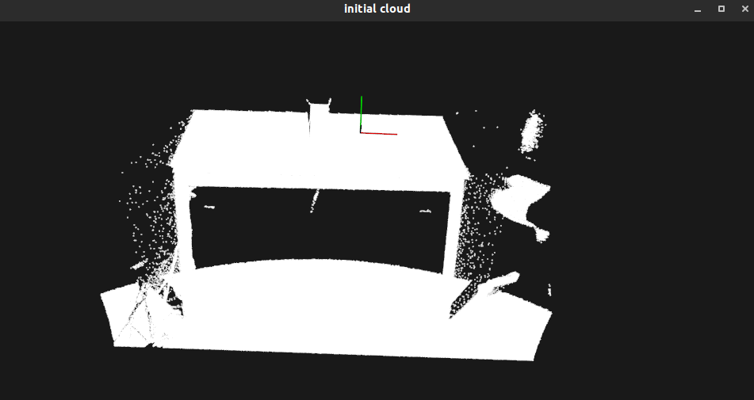
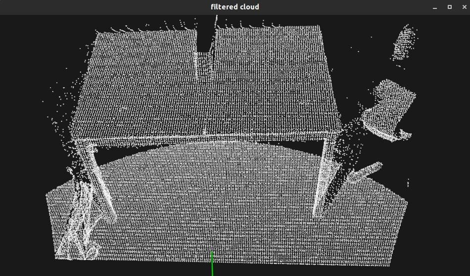
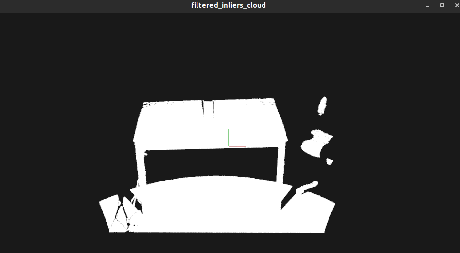
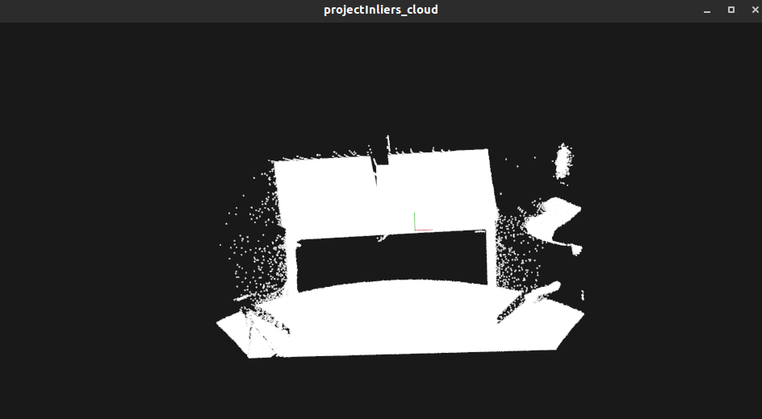

# 过滤

## 1. 直通过滤

在本教程中，我们将学习如何沿着指定的维度执行简单的过滤-即，截取给定用户范围内或外的值。

指定字段，指定坐标范围进行裁剪。可以选择保留范围内的点或者范围外的点。

[代码](./passThroughFilter.cc)

过滤过程的图形显示如下所示。

注意，坐标轴表示为红色（x），绿色（y）和蓝色（z）。 用绿色过滤后剩余的点，用红色表示已被过滤器删除的点。

## 2. 使用VoxelGrid过滤器对PointCloud进行下采样

在本教程中，我们将学习如何使用体素化网格方法对点云数据集进行降采样（即减少点数）。

我们将要呈现的VoxelGrid类在输入点云数据上创建一个3D体素网格（将体素网格视为空间中的一组微小3D框）。 然后，在每个体素（即3D框）中，所有存在的点都将以其质心进行近似（即降采样）。 这种方法比用体素的中心逼近它们要慢一些，但是它可以更准确地表示基本的表面。

[代码](./voxel_grid.cc)

运行结果

## 3. 使用StatisticsOutlierRemoval(统计离群值移除)过滤器删除离群值

在本教程中，我们将学习如何删除噪声测量，例如 使用统计分析技术从点云数据集中获取离群值。

### 背景知识

激光扫描通常会生成不同点密度的点云数据集。此外，测量误差会导致稀疏的异常值，从而进一步破坏结果的准确性。这会使局部点云特征（例如表面法线或曲率变化）的估计复杂化，从而导致错误的值，进而可能导致点云配准失败。通过对每个点的邻域进行统计分析，并修剪不符合特定条件的部分，可以解决其中的一些不规则现象。我们的稀疏离群值消除基于输入数据集中点到邻居距离的分布的计算。 对于每个点，我们计算从它到所有相邻点的平均距离。通过假设结果分布是具有均值和标准差的高斯分布，可以将其平均距离在由全局距离均值和标准差定义的区间之外的所有点视为离群值并从数据集中进行修剪。

下图显示了稀疏离群值分析和删除的效果：原始数据集显示在左侧，而结果数据集显示在右侧。 该图显示了过滤前后点附近的平均k最近邻距离。

[代码](./statistical_removal.cc)

运行结果

## 4. 使用参数模型投影点

在本教程中，我们将学习如何将点投影到参数模型（例如，平面，球体等）上。 参数模型通过一组系数给出-在平面情况下，通过其方程式：ax + by + cz + d = 0。

[代码](./project_inliers.cc)

运行结果,立体物体被投影到X-Y平面上

## 5. 从点云数据提取索引并提取点云的子集

建议看完[点云分割](../segmentation)部分再看此节

在本教程中，我们将学习如何使用：pcl:[`ExtractIndices <pcl::ExtractIndices>`](https://pcl.readthedocs.io/projects/tutorials/en/latest/extract_indices.html#id1)过滤器基于分段算法输出的索引从点云中提取点的子集。 为了不使教程复杂，此处不解释分段算法。 请查看[“平面模型细分”](https://pcl.readthedocs.io/projects/tutorials/en/latest/planar_segmentation.html#planar-segmentation)教程以了解更多信息。

[代码](./extract_indices.cc)

## 6. 使用条件或半径过滤器来删除离群值

本文档演示了如何使用过滤器模块中的几种不同方法从PointCloud中删除异常值。 首先，我们将研究如何使用ConditionalRemoval过滤器，该过滤器将删除给定输入云中不满足一个或多个给定条件的所有索引。 然后，我们将学习如何使用RadiusOutlierRemoval过滤器，该过滤器将删除其输入云中在一定范围内没有至少一些邻居的所有索引。

[代码](remove_outliers.cc)

