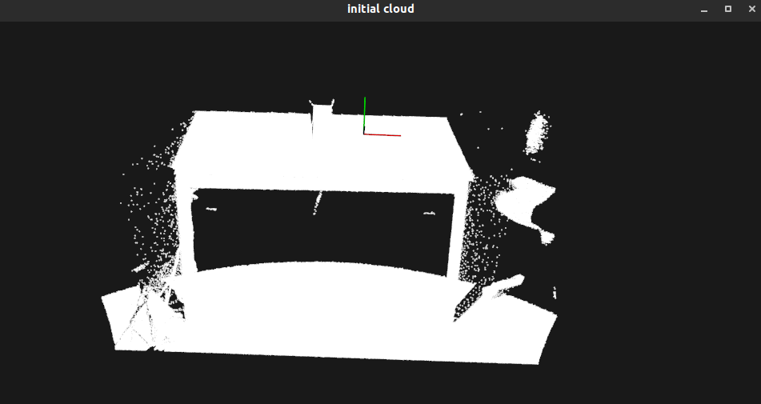
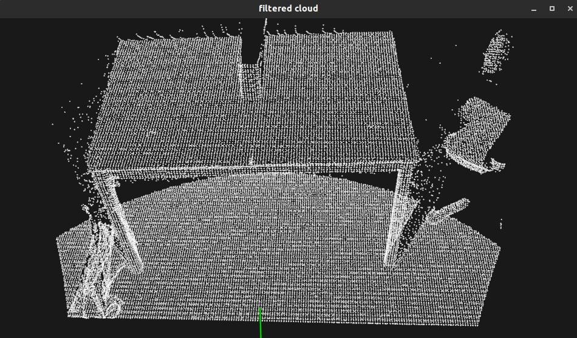

# 滤波

## 1. 直通滤波

在本教程中，我们将学习如何沿着指定的维度执行简单的过滤-即，截取给定用户范围内或外的值。

指定字段，指定坐标范围进行裁剪。可以选择保留范围内的点或者范围外的点。

[代码](./passThroughFilter.cc)

过滤过程的图形显示如下所示。

注意，坐标轴表示为红色（x），绿色（y）和蓝色（z）。 用绿色过滤后剩余的点，用红色表示已被过滤器删除的点。

## 2. 使用VoxelGrid过滤器对PointCloud进行下采样

在本教程中，我们将学习如何使用体素化网格方法对点云数据集进行降采样（即减少点数）。

我们将要呈现的VoxelGrid类在输入点云数据上创建一个3D体素网格（将体素网格视为空间中的一组微小3D框）。 然后，在每个体素（即3D框）中，所有存在的点都将以其质心进行近似（即降采样）。 这种方法比用体素的中心逼近它们要慢一些，但是它可以更准确地表示基本的表面。

[代码](./voxel_grid.cc)

运行结果

